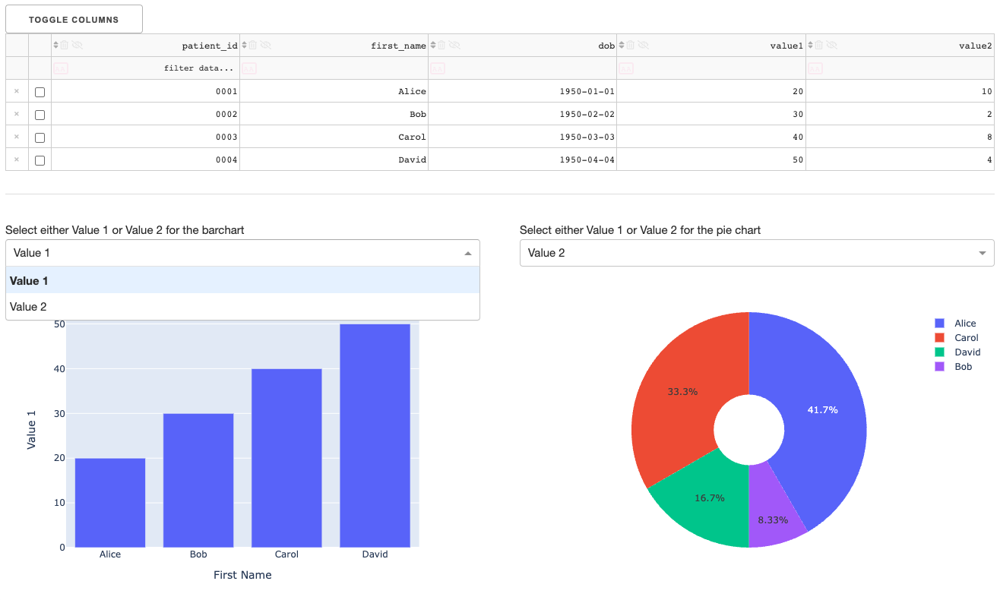

### Dash Demo

A Dash datatable connected with dropdowns and plotly charts.
Editing the datatable will update the charts.
Use the dropdown menus to select which data to display in the charts.

Click on this link to run a live demo:
[Dash Demo](https://degree-teacher-trial-a9rq.herokuapp.com)

---

## Jupyter Notebooks

| Filename                   | Description                                     |
|----------------------------|-------------------------------------------------|
| 04_pandas.ipynb            | Pandas                                          |
| 05_sqlalchemy_join.ipynb   | SQLAlchemy and pandas to load and join SQL data |
| 06_sqlalchemy_update.ipynb | SQLAlchemy to update a SQL table                |
| 07_dash_plotly.ipynb       | Dash and plotly                                 |
| 08_dash_datatable.ipynb    | Dash with Datatable and Barchart                |
| 09_dash_datatable.ipynb    | Dash with Datatable, Dropdowns and Charts       |

